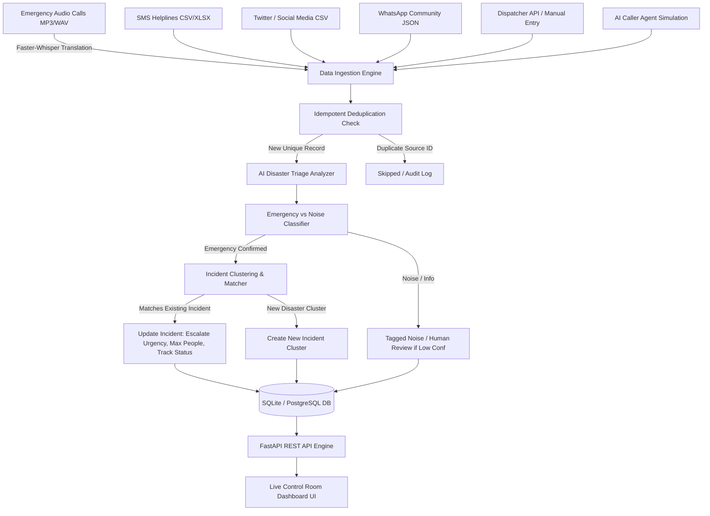

# DisasterAI — AI-Powered Disaster Report Analysis & Incident Management System

DisasterAI is a mission-critical emergency report analysis, multimodal stream ingestion, deduplication, triage, and control-room incident response coordination platform. It unifies high-volume disaster data streams across emergency call audio (MP3/WAV), SMS helplines (CSV/Excel), social media posts (Twitter/X CSV), community feeds (WhatsApp JSON), and manual dispatcher intakes into a single situational awareness control center.

---

## 1. Project Overview

During natural and human-made disasters (e.g., severe urban flooding, transformer explosions, structural collapses), emergency operations centers are overwhelmed by thousands of fragmented, noisy, and cross-channel messages. Responders face three fatal bottlenecks:
1. **Multimodal Information Fragmentation**: Emergency calls in regional languages, SMS texts, and Twitter posts arrive in disconnected silos.
2. **Noise and Rumor Flood**: Up to 40% of incoming messages during disasters are food delivery inquiries, weather forecasts, or rumors that delay life-saving rescue dispatch.
3. **Report Duplication without Incident Clustering**: Dozens of citizens report the same fire or stranded elderly patient, blinding dispatchers to the true count of distinct incidents versus multiple calls describing the same incident.

DisasterAI solves this by ingesting, transcribing, classifying, and deduplicating reports in real time, automatically grouping related reports into evolving Incident Clusters while filtering out noise.

---

## 2. System Architecture



---

## 3. Key Features

- **Multimodal Stream Discovery**: Automatically traverses stage directories discovering nested `.csv`, `.xlsx`, `.xls`, `.json`, and `.mp3` files across arbitrary depth.
- **Speech-to-Text & Translation**: Integrates `faster-whisper` (int8 CPU optimized) with translation capability to transcribe regional languages (Telugu, Hindi, Tamil) into structured English text.
- **Idempotency & Deduplication**: Durable source identifiers (`sms_id`, `tweet_id`, `message_id`, `audio_key`) prevent duplicate reports or inflated incident counts upon repeated stage runs.
- **Explainable Rule-Based & Heuristic NLP**:
  - Distinguishes emergencies from noise (Swiggy inquiries, power cuts, weather rumors).
  - Categorizes incident types: `FIRE`, `FLOOD_RESCUE`, `MEDICAL_RESCUE`, `RESCUE`.
  - Normalizes regional landmarks (e.g., Medavakkam school road, Velachery MRTS backside, Tambaram transformer area).
  - Tracks vulnerable groups (`ELDERLY`, `CHILDREN`, `DIABETIC`) and required resources (`RESCUE_BOAT`, `MEDICAL_SUPPORT`, `FIRE_SERVICE`).
  - Progresses incident status: `NEW` ➔ `ACTIVE` ➔ `RESCUE_IN_PROGRESS` ➔ `RESOLVED`.
- **Dynamic Incident Clustering**: Automatically matches incoming reports to active incident clusters based on normalized locations, keywords, and explicit cross-references ("same incident", "same Medavakkam incident").
- **Control Room Dashboard**: Glassmorphic, dark-mode real-time operator interface displaying live metrics, incident cards, filterable report stream, manual intake, and stage ingestion controls.
- **AI Caller Agent Simulation**: Interactive emergency caller dialogue module that gathers caller descriptions and locations before queuing structured reports for human review.

---

## 4. Technology Stack

- **Backend**: Python 3.11+, FastAPI, Uvicorn, Pydantic v2
- **Database & ORM**: SQLAlchemy 2.0 (SQLite default, PostgreSQL ready)
- **Audio Processing**: Faster-Whisper, CTranslate2, ONNXRuntime
- **Data Ingestion**: Pandas, OpenPyXL
- **Frontend**: Vanilla HTML5, Modern CSS3 (Glassmorphism & CSS Grid), ES6 JavaScript
- **Testing**: Pytest, FastAPI TestClient, HTTPX

---

## 5. Project Directory Structure

```
DisasterAI/
├── backend/
│   ├── database.py         # SQLAlchemy engine & session setup
│   ├── main.py             # FastAPI routes, schemas, and static file mounting
│   ├── migrate.py          # Non-destructive SQLite schema migration script
│   └── models.py           # Report and Incident database models
├── services/
│   ├── ai_analysis.py      # Rule-based emergency classifier, NLP extractor, location normalizer
│   ├── audio_service.py    # Faster-whisper audio transcription & translation
│   ├── caller_service.py   # AI caller agent triage state machine
│   ├── dataset_service.py  # Recursive multi-format stage ingestion & deduplication
│   └── incident_service.py # Centralized incident matching, updating, and linking
├── frontend/
│   ├── index.html          # Control room dashboard UI
│   ├── style.css           # Modern dark-theme glassmorphism styles
│   └── app.js              # Real-time API integration & event handlers
├── data/
│   ├── extracted_stage1/   # Standard disaster dataset (stages 1-3)
│   ├── extracted_stage2/   # Large expanded dataset (stages 1-4)
│   └── disaster.db         # Persistent SQLite database
├── tests/
│   ├── conftest.py         # In-memory test database & TestClient fixtures
│   ├── test_ai_analysis.py # AI NLP classification and extractor tests
│   ├── test_api_endpoints.py # FastAPI route & error handling tests
│   ├── test_audio_service.py # Audio transcription & mock error handling tests
│   ├── test_dataset_discovery.py # Stage path normalization tests
│   ├── test_incident_management.py # Incident creation & escalation tests
│   ├── test_stage_ingestion_end_to_end.py # Full pipeline & idempotency test
│   └── test_tabular_processing.py # CSV/JSON parsing & duplicate rejection tests
├── pytest.ini              # Pytest configuration with root pythonpath
├── requirements.txt        # Pinned dependency requirements
├── .env.example            # Environment configuration template
└── README.md               # Complete project documentation
```

---

## 6. Supported Dataset Formats & Schemas

### SMS Helpline (CSV / XLSX)
Required columns:
```csv
sms_id,timestamp,sender,message
stage_1_sms_036,2026-10-07T08:21:35,HELPLINE,Boat reached second lane behind school. Elderly woman and children are being moved first.
```

### Twitter / Social Media Feed (CSV / XLSX)
Required columns:
```csv
tweet_id,timestamp,username,text
stage_1_tw_024,2026-10-07T08:14:11,@chennai_help_62,Fire near Sanatorium station backside is now fully controlled. 18 people were affected.
```

### WhatsApp Community Messages (JSON)
Required structure:
```json
{
  "messages": [
    {
      "message_id": "stage_1_wa_002",
      "timestamp": "2026-10-07T08:00:37",
      "sender": "resident_328",
      "text": "Same Velachery MRTS incident. Rescue team arrived and insulin was delivered."
    }
  ]
}
```

### Emergency Audio Calls (MP3 / WAV)
- Files named `call_001_stage_1.mp3`, `stage_1_call_001.mp3`, etc.
- Ingested recursively and transcribed via `faster-whisper`.
- Regional audio (Telugu/Hindi/English mix) is automatically translated to English.

---

## 7. Installation & Setup (Windows PowerShell)

### Prerequisites
- Python 3.11, 3.12, or 3.13 installed.
- Git (optional).

### 1. Clone & Navigate
```powershell
cd C:\Users\mudir\Desktop\DisasterAI
```

### 2. Activate Virtual Environment
```powershell
.\venv\Scripts\Activate.ps1
```

### 3. Install Dependencies
```powershell
pip install -r requirements.txt
```

### 4. Configure Environment
Copy `.env.example` to `.env`:
```powershell
Copy-Item .env.example .env
```

---

## 8. Database Migrations

DisasterAI includes an automated, non-destructive migration script that ensures all tables and indices exist without resetting or deleting existing reports:

```powershell
python backend/migrate.py
```

*Note: The migration script runs automatically whenever the FastAPI backend starts.*

---

## 9. Starting the Application

Start the backend server using Uvicorn:

```powershell
.\venv\Scripts\python -m uvicorn backend.main:app --host 127.0.0.1 --port 8000 --reload
```

- **Dashboard UI**: [http://127.0.0.1:8000/](http://127.0.0.1:8000/)
- **Interactive Swagger API Docs**: [http://127.0.0.1:8000/docs](http://127.0.0.1:8000/docs)
- **Health Check**: [http://127.0.0.1:8000/health](http://127.0.0.1:8000/health)

---

## 10. API Endpoint Reference

### System & Dashboard
- `GET /health` — Check database connection and service health.
- `GET /api/dashboard` — Live counts of reports, confirmed emergencies, noise, review items, and active/resolved incidents.

### Reports
- `POST /api/reports` — Submit and analyze an emergency report.
  ```json
  {
    "source": "API",
    "source_id": "call_102",
    "message": "Heavy flooding near Medavakkam school road. 6 people trapped."
  }
  ```
- `GET /api/reports?limit=100&offset=0&is_emergency=true&source=SMS` — Filter and paginate reports.
- `GET /api/reports/{id}` — Retrieve report details and metadata.
- `PATCH /api/reports/{id}/review` — Update human review status (`{"needs_review": false}`).

### Incidents
- `GET /api/incidents?status=ACTIVE&urgency=HIGH` — List incident clusters.
- `GET /api/incidents/{id}` — Get single incident and all linked emergency reports.
- `PATCH /api/incidents/{id}/status` — Update incident status (`{"status": "RESOLVED"}`). Allowed: `NEW`, `ACTIVE`, `ESCALATING`, `RESCUE_IN_PROGRESS`, `RESOLVED`.

### Dataset Stream Ingestion
- `GET /api/dataset/stages` — Discovers and lists available stage directories on disk.
- `POST /api/dataset/stage/{stage_name}?variant=large` — Ingests a complete stage stream.
  - `stage_name`: `stage1`, `stage2`, `stage3`, `stage4`
  - `variant`: `large` (default) or `standard`
  - Response includes: `reports_created`, `duplicates_skipped`, `emergencies_detected`, `new_incidents`, `matched_existing_incidents`, `errors`.

### AI Caller Agent
- `POST /api/caller/session` — Initiates an emergency intake caller line.
- `POST /api/caller/interact` — Processes caller statements, extracts emergency details, or escalates to a human operator.

---

## 11. Automated Testing

Run the test suite using pytest:

```powershell
.\venv\Scripts\pytest -v
```

All 28 tests execute in an isolated in-memory test database, ensuring zero contamination of production data:
- `test_ai_analysis.py`: Emergency classification, location normalization, and people extraction.
- `test_api_endpoints.py`: FastAPI route contracts, responses, and caller intake.
- `test_audio_service.py`: Faster-whisper audio transcription and error handling.
- `test_dataset_discovery.py`: Flexible stage and variant folder discovery.
- `test_incident_management.py`: Dynamic clustering, escalation, and resolution.
- `test_stage_ingestion_end_to_end.py`: End-to-end stage processing and idempotency validation.
- `test_tabular_processing.py`: SMS, Twitter, and WhatsApp parser validation.

---

## 12. Security & Operational Safety

1. **Human-in-the-Loop Safeguard**: AI classification never triggers real-world emergency dispatch automatically. Ambiguous reports are tagged `needs_review: true` for control-room review.
2. **Idempotency Guarantee**: Reports are indexed on `source_id`. Ingesting the same stream multiple times produces 0 duplicate records.
3. **Database Integrity**: Non-destructive migrations preserve all historic reports and incident audit trails. Foreign keys maintain referential links between reports and incidents.
4. **Offline Capability**: The core rule-based NLP extraction and audio transcription run entirely on local CPU without requiring external paid LLM APIs or internet connectivity.
